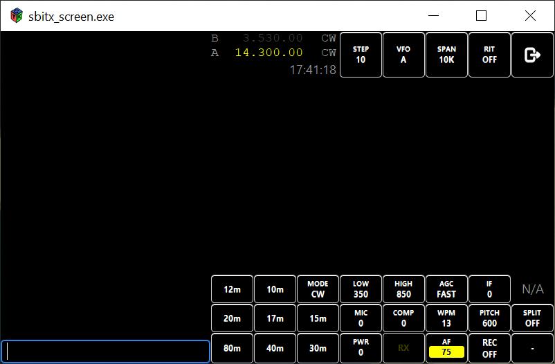

# An interface for the sbitx using gtk.

*This is a work in progress.*

The large encoder (main encoder) adjusts the frequency of either the A or B VFO as selected by the **VFO** button. The stepping of the VFO tuning is controlled by the **STEP** button.

The small encoder (sub-encoder) controls the AF, IF, LOW, HIGH, MIC, COMP, WPM, PITCH and PWR settings.

Click on the desired button, the value will highlight in yellow and the sub-encoder will adjust the value. After 10 seconds of sub-encoder activity, the highlight will return to the AF and the sub-encoder will adjust the AF (default) value.

* **AF**: range 0 .. 100 (step size 1)
* **IF**: range 0 .. 100 (step size 1)
* **LOW**: range 0 .. 50 Hz below the HIGH setting (step size 50)
* **HIGH**: range 50 Hz above the LOW setting .. 4000 (step size 50)
* **MIC**: range 0 .. 100 (step size 1)
* **COMP**: range 0 .. 100 (step size 1)
* **WPM**: range 5 .. 40 (step size 1)
* **PITCH**: range 300 .. 1500 (step size 10)
* **PWR**: range 0 .. 100 (step size 1)

The **STEP** button cycles among 10 Hz, 100 Hz, 1 kHz, 10 kHz, 100 kHz and 1 MHz.

The **VFO** button toggles between V and B.

The **SPAN** button cycles among 1.25 kHz, 2.5 kHz, 5 kHz, 10 kHz, 20 kHz and 24 kHz.

The **RIT** button toggles between ON and OFF.

The **SPLIT** button toggles between ON and OFF.

The **MODE** button cycles among LSB, USB, CW-R and CW.

The **RX** button toggles between RX and TX.

The **REC** button toggles between ON and OFF.

The **10m**, **12m**, **15m**, **17m**, **20m**, **30m**, **40m** and **80m** buttons implement band-stacking cycling among 4 settings for each band.

The top right button quits the program.

The bottom right (-) button minimizes the screen.

